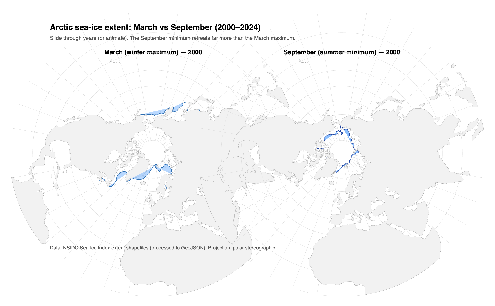
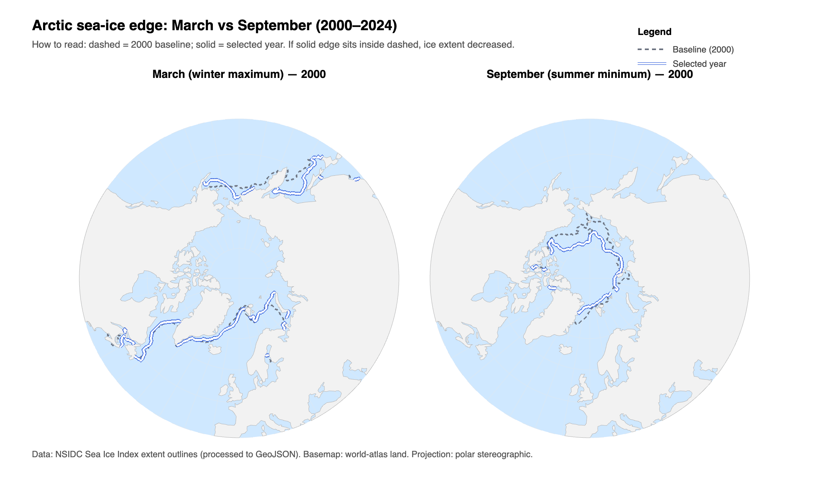
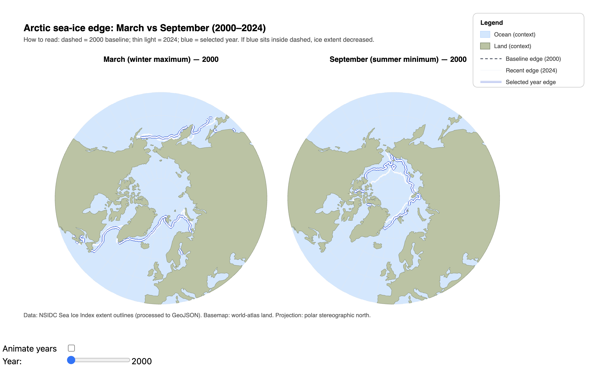

# Visualization Log — Arctic Sea-Ice Edge (2000–2024)

## Important note about the dataset (why no filled ice area)
The NSIDC “sea-ice extent outlines” data I used contains **polylines (edge contours)**, not polygons.  
That means the geometry represents the **ice edge boundary line** only, not a closed surface that can be reliably filled.  
So the visualization communicates change via **moving outlines (edges)** rather than a filled “ice area”.

A filled extent would require polygon geometry (or raster concentration grids), which is not present here.

---

## Iteration 1 — Initial concept (too much context, weak focus)

**Visual:**

**What I built**
- I started with a global-looking view and tried to show sea-ice change over time with a year control.

**What I found (drawbacks)**
- The map showed **too much of the world**, so the viewer’s attention drifted away from the Arctic.
- The message “ice is shrinking” was not immediately obvious because the context dominated the signal.
- The comparison between time points was not strong (no stable reference/baseline).

---

## Iteration 2 — Focused Arctic panels + baseline comparison (big clarity jump)

**Visual:**

**What I changed**
- I switched to **two separate panels**:  
  - **March** (winter maximum) on the left  
  - **September** (summer minimum) on the right
- I used a **polar stereographic projection** centered on the North Pole to keep the Arctic as the focal region.
- I introduced a **fixed baseline year (2000)** drawn as a **grey dashed line**, and kept the selected year as a **solid blue line**.
- I added a year slider (and optional animation) so the user can explore the time series interactively.

**What improved**
- The visualization became much more **readable** because the Arctic is always centered.
- The two-panel layout supports **direct seasonal comparison** (March vs September).
- The baseline vs selected-year encoding makes “retreat/growth” interpretable at a glance:  
  - if the blue line sits **inside** the dashed baseline, the extent is **smaller** than 2000.

**Remaining drawbacks**
- Even though the ocean was light blue, the **ice was still only an outline**, so some viewers may expect better contrast.
- Land/ocean styling was still fairly neutral; the figure looked clean, but less “satellite-like”.

---

## Iteration 3 — Final design polish + stronger narrative cues (final)

**Visual:**

**What I refined**
- I kept the successful structure from Iteration 2 (two panels, same projection, same baseline logic).
- I improved **visual hierarchy and spacing** so title, explanation, maps, legend, and controls do not compete.
- I refined the **context colors** (ocean + land) to improve contrast while keeping focus on the ice-edge lines.
- I expanded the legend so the encodings are unambiguous:
  - dashed grey = baseline (2000)
  - solid blue = selected year
  - (optional) recent edge reference if included in the final version

**Why this version communicates the message best**
- The **baseline remains fixed**, so change is perceived as a movement of the selected-year line, not a shifting map.
- The two-panel design isolates **seasonal extremes**, making the September retreat especially clear.
- The result has a high **data-to-ink ratio**: minimal decoration, maximal interpretability.

**How it fulfills what I promised in section 3.1.3**
- **Clarity & truthful encoding:** change is shown through a stable baseline vs selected year (no misleading animation tricks).
- **Comparability:** March and September are shown side-by-side using consistent projection, scale, and styling.
- **Interactive exploration:** year slider (and optional autoplay) supports scanning the full period 2000–2024.
- **Focus on the Arctic:** polar stereographic view keeps the message geographically centered where it matters.
- **Explainability:** legend + “how to read” text make the interpretation explicit for non-experts.

